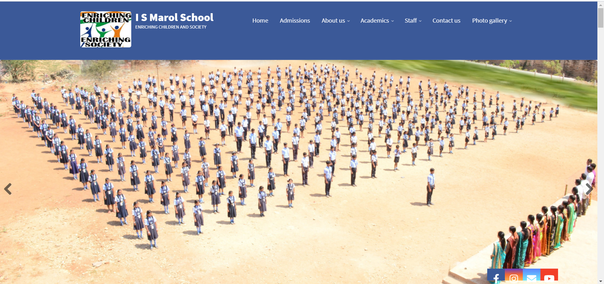

## School Website Created by Using Drupal 8 (Site Building)
1. Installed drupal 8.8.5.
2. Installed admin Tool bar to use administration menu.
3. Installed conference lite theme  and added theme slogan and logo in the site settings.
4. To create banner slide show on the front page installed views slideshow module and enabled it. 
5.  In the root folder create libraries folder--> name it (jquery.cycle) -->( add file)jquery.cycle.all (jquery plugin for slideshow)
6. To create responsive slide show installed flexslider module and library and enabled it
-->  To create responsive slideshow on the front page
      1.Installed libraries API module
      2.Installed flexslider module in the modules folder and create libraries folder in the root folder and extract flexslider libraries
      3.Created custom content type and added image field and added images to that field
      4.created view 
      5 In view settings -->added fields of that content type and hid the label (uncheck exclude from display)
      6. In multiple field settings unchecked the same row paragraph(it is in field setting do it while adding fields and in configure field settings)
      7. Place the view block in banner block 
7. To create responsive menu on the main navigation installed superfish module and enabled it 
     1. extracted superfish library and jquery easing in libraries folder
     2. Created menu and added respective links
     3. Removed the current navigation that it has in the header
     4. Placed the superfish block(menu name that you created) in the header navigation 

8. Webform module ( To create contact form)
   1. Installed webform, ctools, views and token modules
   2. downloaded webform module
   3. enabled webform and webform UI
   4. structure-->webform-->configuration-->libraries(downloaded and installed in the libraries folder)
   5. go to advanced section and uncheck CDN

 9. Full view calendar
     1. Installed full view calendar module and enabled it.
     2. Created content types related to your events and add specific  fields and start date and end date.
     3. Created content for the content type.
     4. Created view select block and pager
     5. In filter criteria go to add tab beside that dropdown select add/rearrange and remove event content type
     6. Click again add tab and search content type select and apply
     7. Configured filter criteria select (operator) is one of   and check created content types and click apply
     8. Added fields in fields section.
     9. In full calendar display settings--> added particular fields and colors and saved 
       
10. Simple google map
     1. Installed simple google map
     2. Added text plain field to the block type
     3. In the manage display  section select the  text filed settings to map
     
11. Social media Icons
    Installed Floating social icons module to create social media icons
 
 <a href = "https://www.ismarol.org">Live Preview</a>

